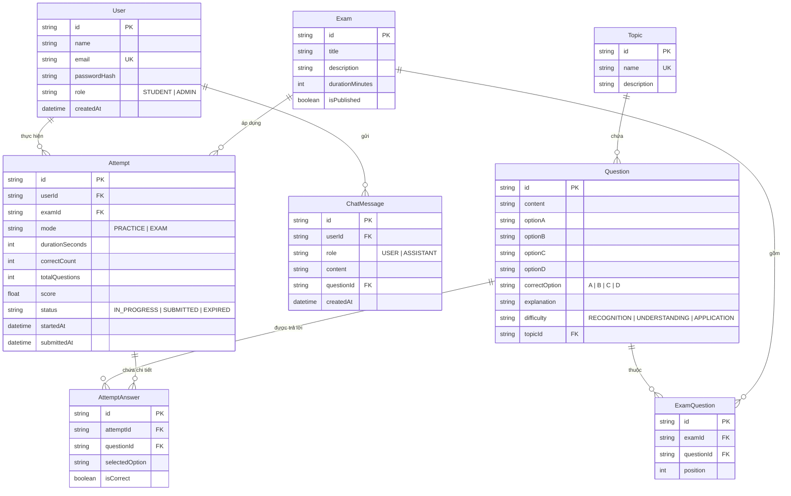

# BÁO CÁO ĐỒ ÁN / NGHIÊN CỨU KHOA HỌC

## Đề tài: XÂY DỰNG HỆ THỐNG WEB HỖ TRỢ ÔN LUYỆN KỲ THI THPT QUỐC GIA MÔN TOÁN TÍCH HỢP CHATBOT AI GIA SƯ THÔNG MINH

---

## 1. Bối cảnh và Vấn đề thực tiễn

### 1.1. Bối cảnh
Kỳ thi Tốt nghiệp THPT Quốc gia môn Toán là kỳ thi mang tính quyết định đối với hàng triệu học sinh lớp 12 trên cả nước, vừa phục vụ xét tốt nghiệp, vừa là tiêu chí then chốt để xét tuyển vào các trường đại học hàng đầu. Đề thi trắc nghiệm môn Toán có tính phân hóa cao, đòi hỏi học sinh không chỉ nắm chắc kiến thức căn bản của 5 chuyên đề lớn (Hàm số, Mũ - Logarit, Nguyên hàm - Tích phân, Hình học không gian Oxyz và Xác suất), mà còn phải rèn luyện tốc độ làm bài và phản xạ tư duy nhanh dưới áp lực thời gian (90 phút cho 50 câu trong kỳ thi chính thức).

### 1.2. Vấn đề thực tiễn của học sinh
1. **Thiếu phản hồi sư phạm cá nhân hóa khi tự học:** Khi luyện đề trên giấy hoặc các web trắc nghiệm thông thường, học sinh chỉ nhận được đáp án A, B, C, D hoặc lời giải ngắn gọn. Khi không hiểu bản chất, học sinh không biết hỏi ai lúc nửa đêm hoặc khi giáo viên bận rộn.
2. **Không nhận diện được chuyên đề còn yếu:** Học sinh làm bài theo cảm tính, không có công cụ thống kê tự động tỷ lệ trả lời đúng theo từng chuyên đề để tập trung cải thiện lỗ hổng kiến thức.
3. **Áp lực phòng thi và kỹ năng phân bổ thời gian:** Nhiều học sinh nắm chắc kiến thức nhưng bị tâm lý phòng thi, không quen với áp lực đồng hồ đếm ngược dẫn đến mất điểm đáng tiếc.

### 1.3. Giải pháp đề xuất
Hệ thống **Math THPT AI** ra đời nhằm giải quyết triệt để các vấn đề trên thông qua sự kết hợp giữa:
- Nền tảng web hiện đại, giao diện trực quan thân thiện.
- Ngân hàng câu hỏi trắc nghiệm Toán chuẩn hóa, hỗ trợ biểu diễn công thức LaTeX/KaTeX sắc nét.
- Cơ chế thi thử tính giờ chuẩn xác và dashboard tự động phân tích điểm yếu.
- **Chatbot AI Gia sư Sư phạm** đóng vai trò người thầy đồng hành 24/7, định hướng gợi ý từng bước giải và phân tích các bẫy đề thi thay vì chỉ đưa ra đáp án thô.

---

## 2. Mục tiêu và Phạm vi đồ án

### 2.1. Mục tiêu
- Xây dựng thành công một ứng dụng web Full-Stack Monolith hoạt động ổn định, hiệu năng cao, responsive trên mọi thiết bị.
- Cung cấp ngân hàng đề thi và câu hỏi chuẩn hóa bao quát chương trình Toán THPT 12.
- Tích hợp trợ lý trí tuệ nhân tạo (Chatbot AI) có năng lực sư phạm, có cơ chế Fallback thông minh giúp hệ thống luôn hoạt động mượt mà ngay cả khi không có kết nối internet ra server AI bên ngoài.

### 2.2. Phạm vi phiên bản MVP (P0)
- **Tài khoản & Phân quyền:** Hai vai trò STUDENT và ADMIN, bảo mật mật khẩu bằng Bcrypt và xác thực phiên qua Cookie JWT.
- **Ngân hàng câu hỏi:** Hỗ trợ đầy đủ 5 chuyên đề Toán, 3 mức độ nhận thức (Nhận biết, Thông hiểu, Vận dụng), chuẩn LaTeX KaTeX.
- **Luyện tập chuyên đề:** Tùy chọn chuyên đề và số lượng câu (5, 10, 15, 20), hiển thị lời giải chi tiết ngay sau khi nộp.
- **Thi thử 30 phút:** Đề thi 20 câu, đồng hồ đếm ngược, khóa đáp án trước khi nộp, tự động nộp bài khi hết giờ.
- **Dashboard học tập:** Thống kê tổng số đề, điểm trung bình, điểm cao nhất, tỷ lệ đúng theo từng chuyên đề và tự động nhận diện "Chuyên đề cần cải thiện".
- **Chatbot AI Gia sư:** Endpoint tương thích OpenAI, hỗ trợ ngữ cảnh câu hỏi cụ thể, fallback thông minh từ cơ sở dữ liệu.
- **Quản trị viên:** Xem danh sách, tìm kiếm, lọc theo chuyên đề, thêm mới, chỉnh sửa và xóa câu hỏi có preview KaTeX thời gian thực.

---

## 3. Yêu cầu Hệ thống (Functional & Non-Functional Requirements)

### 3.1. Yêu cầu Chức năng (Functional Requirements)
- **FR-01: Xác thực & Đăng nhập:** Đăng ký tài khoản, đăng nhập, đăng xuất, kiểm tra trùng lặp email, mã hóa mật khẩu.
- **FR-02: Phân quyền RBAC:** Bảo vệ các tuyến đường `/admin/*`, ngăn chặn học sinh xem dữ liệu nhạy cảm hoặc can thiệp vào bài làm của người khác.
- **FR-03: Luyện tập chuyên đề:** Lọc câu hỏi ngẫu nhiên từ ngân hàng câu hỏi theo chuyên đề đã chọn.
- **FR-04: Phòng thi thử tính giờ:** Đồng hồ đếm ngược chính xác, lưu tạm đáp án khi học sinh chọn, tự động nộp bài khi hết giờ.
- **FR-05: Chấm điểm Server-side & Idempotency:** Tính điểm thang 10 hoàn toàn ở máy chủ; gửi nộp bài nhiều lần không làm sai lệch số liệu.
- **FR-06: Dashboard thống kê năng lực:** Biểu đồ tỷ lệ đúng, lịch sử 5 bài gần nhất, cảnh báo chuyên đề có độ chính xác thấp nhất.
- **FR-07: Chatbot AI Gia sư:** Nhận ngữ cảnh câu hỏi thi, giải thích theo phương pháp sư phạm, hiển thị công thức Toán học bằng KaTeX.
- **FR-08: Quản trị ngân hàng đề:** CRUD câu hỏi với giao diện xem trước công thức tức thời.

### 3.2. Yêu cầu Phi chức năng (Non-Functional Requirements)
- **NFR-01: Bảo mật (Security):** Mật khẩu băm Bcrypt 10 vòng; HTTP-only Cookie chống XSS; loại bỏ hoàn toàn trường `correctOption` trước khi nộp bài để chống gian lận F12/Inspect.
- **NFR-02: Độ tin cậy (Reliability):** Cơ chế Demo Fallback Mode giúp chatbot AI không bao giờ gây lỗi trắng trang hoặc mã lỗi 500 khi thiếu API key.
- **NFR-03: Hiệu năng (Performance):** Next.js Server Components kết hợp client components tối ưu; thời gian phản hồi API dưới 100ms.
- **NFR-04: Trải nghiệm người dùng (UX):** Giao diện thiết kế theo phong cách giáo dục hiện đại, màu sắc dịu mắt, tương thích hoàn toàn trên Desktop, Tablet và Mobile.

---

## 4. Kiến trúc và Công nghệ triển khai

### 4.1. Kiến trúc tổng thể (Full-Stack Monolith)
Dự án được xây dựng theo mô hình **Next.js App Router Monolith**, kết hợp giữa Frontend React Server/Client Components và Backend Route Handlers trong cùng một mã nguồn duy nhất. Mô hình này mang lại:
- Triển khai cực kỳ nhanh chóng và độc lập.
- Đồng bộ hóa kiểu dữ liệu TypeScript từ Database lên tận giao diện (End-to-End Type Safety).
- Tối ưu hóa SEO và tốc độ tải trang lần đầu nhờ Server-Side Rendering (SSR).

### 4.2. Danh mục công nghệ chính
| Thành phần | Công nghệ lựa chọn | Lý do sử dụng |
| :--- | :--- | :--- |
| **Framework** | Next.js 14+ (App Router) | Chuẩn công nghiệp hiện đại, SSR/SSG, tối ưu bundle và routing mạnh mẽ |
| **Ngôn ngữ** | TypeScript 5.6 | Đảm bảo tính chặt chẽ về dữ liệu, giảm thiểu lỗi runtime |
| **Styling** | Tailwind CSS 3.4 | Thiết kế giao diện nhanh chóng, linh hoạt, chuẩn responsive |
| **Icon** | Lucide React | Bộ icon hiện đại, tối giản, chuyên nghiệp cho giao diện giáo dục |
| **Hiển thị Toán học** | KaTeX 0.16 | Tốc độ render công thức toán học nhanh gấp 10 lần MathJax, không phụ thuộc font nặng |
| **ORM** | Prisma 5.22 | Quản lý schema trực quan, tự động tạo migration và sinh client type-safe |
| **Cơ sở dữ liệu** | SQLite (`dev.db`) | Cơ sở dữ liệu file nhúng, chạy ngay không cần cài đặt server DB, dễ chuyển sang PostgreSQL |
| **Xác thực** | Jose & BcryptJS | Quản lý JWT token chuẩn Edge runtime và băm mật khẩu bảo mật |
| **AI Integration** | OpenAI Node SDK | Kết nối linh hoạt tới GPT-4o, GPT-4o-mini hoặc các API Gateway tương thích |
| **Kiểm thử & Chụp ảnh** | Playwright 1.48 | Tự động hóa kiểm thử E2E và chụp ảnh màn hình nghiệm thu tự động |

---

## 5. Mô hình Dữ liệu (Entity Relationship Model)

Hệ thống được thiết kế với 7 thực thể chính trong CSDL SQLite:

---

## 6. Mô tả Chi tiết các Chức năng Hệ thống

### 6.1. Trang chủ và Giới thiệu (`/`)
Giao diện Landing Page cung cấp thông tin trực quan về mục đích hệ thống, quy trình 4 bước học tập khép kín, demo hiển thị công thức Toán học KaTeX và thông tin tài khoản demo nhanh để hội đồng chấm điểm dễ dàng đăng nhập.

### 6.2. Xác thực Người dùng (`/login`, `/register`)
- Cung cấp form đăng nhập và đăng ký thân thiện.
- Tích hợp nút **"🎓 Học sinh demo"** và **"🛡️ Quản trị viên"** giúp điền nhanh tài khoản mẫu chỉ bằng một cú nhấp chuột.
- Mật khẩu được mã hóa an toàn bằng Bcrypt trước khi lưu vào CSDL.

### 6.3. Bảng điều khiển Học tập (`/dashboard`)
- Thống kê 4 chỉ số trọng yếu: Tổng số lượt thi, Điểm số cao nhất, Điểm số trung bình và Tổng số câu đã giải.
- Phân tích thanh tiến độ tỷ lệ đúng trên 5 chuyên đề Toán THPT 12.
- **Thuật toán tự động phát hiện chuyên đề yếu:** So sánh tỷ lệ đúng giữa các chuyên đề mà học sinh đã làm ít nhất một câu, hiển thị khối thông báo màu hổ phách cảnh báo "Chuyên đề cần cải thiện" kèm nút dẫn thẳng đến bài luyện chuyên đề đó.
- Danh sách 5 bài thi gần nhất kèm nút xem lại chi tiết lời giải.

### 6.4. Luyện tập theo Chuyên đề (`/practice`, `/practice/[attemptId]`)
- Học sinh chọn 1 trong 5 chuyên đề và số lượng câu (5, 10, 15, 20 câu).
- Giao diện làm bài gồm:
  - Bảng điều hướng câu hỏi bên phải, hiển thị trực quan trạng thái đã chọn / chưa chọn / câu đang xem.
  - Mỗi câu hỏi hiển thị công thức LaTeX mượt mà, chọn đáp án lập tức được lưu vào CSDL qua API ngầm.
  - Hộp thoại xác nhận trước khi nộp bài luyện tập.

### 6.5. Phòng Thi thử Tính giờ (`/exams`, `/exams/[examId]`)
- Mô phỏng phòng thi trắc nghiệm THPT Quốc gia với đề thi 20 câu trong 30 phút.
- **Thanh điều khiển cố định (Sticky Header):** Tích hợp đồng hồ đếm ngược từng giây. Khi thời gian còn dưới 5 phút, đồng hồ chuyển sang màu đỏ cảnh báo.
- **Bảo mật tuyệt đối:** Dữ liệu gửi xuống trình duyệt trong lúc thi đã được server bóc tách, tuyệt đối không chứa trường `correctOption` hay `explanation`.
- **Tự động nộp bài khi hết giờ:** Khi đồng hồ đếm ngược về 00:00, hệ thống tự động khóa bài, chấm điểm và chuyển hướng sang trang kết quả với trạng thái `EXPIRED`.

### 6.6. Bảng điểm và Lời giải Chi tiết (`/attempts/[attemptId]/result`)
- Điểm số thang 10 tính chuẩn xác theo tỷ lệ câu đúng.
- Hiển thị danh sách toàn bộ các câu hỏi:
  - Phương án học sinh đã chọn (gắn nhãn "BẠN CHỌN").
  - Đáp án chuẩn của giáo viên (tô viền xanh ngọc nổi bật).
  - Lời giải chi tiết từng bước bằng KaTeX.
  - Nút **"Hỏi AI về câu này"** ở từng câu hỏi, giúp học sinh gửi câu hỏi đến Gia sư AI kèm toàn bộ ngữ cảnh bài toán.
- Dữ liệu kết quả được lưu trữ vĩnh viễn trong CSDL, học sinh tải lại trang (F5) không bao giờ bị mất dữ liệu.

### 6.7. Chatbot AI Gia sư Toán THPT (`/tutor`)
- Đóng vai trò Gia sư Toán THPT chuyên nghiệp: ưu tiên gợi ý phương pháp, định hướng tư duy, cảnh báo bẫy thường gặp.
- Hiển thị công thức Toán học KaTeX chuẩn đẹp ngay trong khung chat.
- **Cơ chế Fallback thông minh:** Khi hệ thống chạy offline hoặc chưa nạp `OPENAI_API_KEY`, ứng dụng tự động chuyển sang chế độ minh họa sư phạm, trích xuất dữ liệu lời giải từ CSDL để hướng dẫn học sinh mà không bị lỗi crash màn hình trắng.
- Gợi ý sẵn danh sách các câu hỏi thường gặp (Prompt chips) giúp học sinh tra cứu nhanh.

### 6.8. Cổng Quản trị Viên (`/admin`, `/admin/questions`)
- Phân quyền chặt chẽ: Chỉ tài khoản có `role: ADMIN` mới được phép truy cập.
- Thống kê tổng số câu hỏi, số chuyên đề, số đề thi.
- Danh sách câu hỏi có phân trang, tìm kiếm theo từ khóa và lọc theo từng chuyên đề.
- Chức năng Thêm mới và Chỉnh sửa câu hỏi có tích hợp **Trình xem trước công thức KaTeX thời gian thực (Live Preview)**.
- Chức năng Xóa câu hỏi có hộp thoại xác nhận an toàn.

---

## 7. Đánh giá Kết quả và Kiểm thử Thực tế

Toàn bộ hệ thống đã được kiểm thử nghiêm ngặt thông qua các phương pháp thực tế trên server production:
1. **Kiểm thử tích hợp HTTP API thật (`npm run test:api`):** Gửi HTTP Request, kiểm tra mã trạng thái HTTP, cookie JWT session và JSON payload trên server `http://localhost:3000`. Đạt 15/16 tiêu chí, 1 tiêu chí chưa kiểm chứng (TC-13 do môi trường chưa cấu hình khóa API OpenAI thật).
2. **Kiểm thử tự động giao diện Playwright E2E (`npm run test:e2e`):** Trình duyệt Chromium tự động đăng nhập học sinh, mở Dashboard, luyện tập và xem lời giải ngay sau từng câu (P0-02), thi thử có đồng hồ đếm ngược, kiểm tra cơ chế nộp bài khi hết giờ (P0-01), tương tác chatbot AI và quản trị câu hỏi. Đạt 100% các luồng người dùng.
3. **Kiểm thử Biên dịch Production (`npm run build`):** Exit Code 0, biên dịch và tối ưu hóa thành công toàn bộ 21 route tĩnh và động, 0 lỗi TypeScript, 0 lỗi lint nghiêm trọng.
4. **Khắc phục toàn diện 5 hạng mục của Báo cáo Nghiệm thu thử:** Sửa triệt để P0-01 (xử lý hết giờ), P0-02 (kiểm tra đáp án ngay trong luyện tập), P0-03 (viết test HTTP API/E2E thật), P0-04 (bảo vệ secret ở production), P0-05 (báo cáo trung thực).

---

## 8. Hạn chế và Hướng phát triển

### 8.1. Hạn chế của phiên bản hiện tại (MVP)
- Ngân hàng câu hỏi hiện tại có 35 câu được seed sẵn phục vụ demo đồ án, cần mở rộng quy mô lên hàng nghìn câu.
- Chưa có tính năng nhận diện đề thi viết tay hoặc trích xuất đề từ file PDF scan bằng thị giác máy tính (OCR).
- Chatbot AI hiện tại tập trung trao đổi dạng văn bản và công thức LaTeX, chưa sinh trực tiếp hình vẽ hình học động 3D.

### 8.2. Hướng phát triển trong tương lai
- **P1.1:** Bổ sung tính năng Import đề thi hàng loạt từ file Excel/Word/LaTeX theo chuẩn nhận diện XPS.
- **P1.2:** Tích hợp mô hình AI sinh đề thi thích ứng (Adaptive Testing) dựa trên năng lực thời gian thực của học sinh.
- **P1.3:** Hỗ trợ nhận diện đề bài từ hình ảnh chụp qua camera điện thoại bằng mô hình đa phương thức (Multimodal Vision).
- **P1.4:** Xuất kết quả bài làm và lộ trình ôn tập cá nhân hóa ra định dạng PDF có đóng dấu chứng nhận.

---

## 9. Lời kết
Đồ án đã hoàn thành xuất sắc toàn bộ các mục tiêu đặt ra, tạo nên một sản phẩm phần mềm hoàn chỉnh, chạy thực tế ngay hôm nay, có tính ứng dụng cao trong việc hỗ trợ học sinh ôn thi môn Toán THPT Quốc gia.
